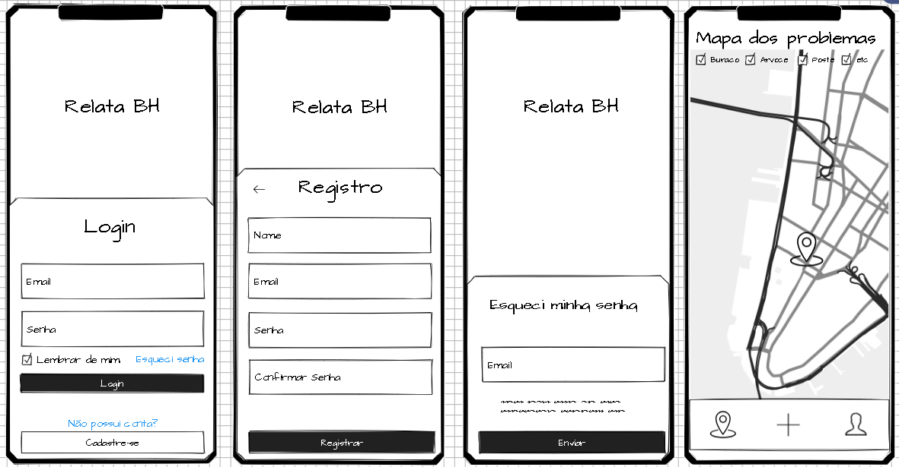
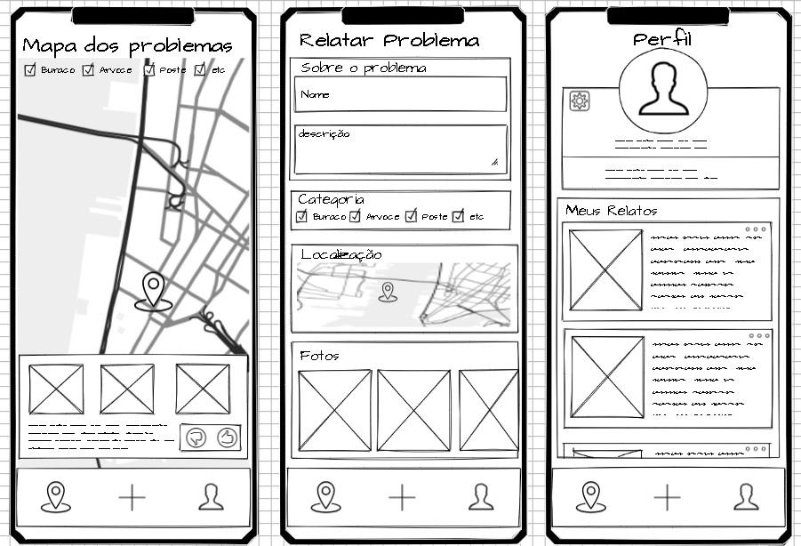

# Projeto de Interface

Pré-requisitos: <a href="2-Especificação do Projeto.md"> Documentação de Especificação</a>

Visão geral da interação do usuário pelas telas do sistema e protótipo interativo das telas com as funcionalidades que fazem parte do sistema (wireframes).

https://www.figma.com/proto/oyAl1T2O1CkknOallWAoVG/RelataBH?node-id=253-1362&node-type=canvas&t=hhtvXtZP3WYBkls5-1&scaling=scale-down&content-scaling=fixed&page-id=0%3A1&starting-point-node-id=253%3A1362&show-proto-sidebar=1

## Diagrama de Fluxo

https://lucid.app/lucidspark/74a3b835-4928-40ec-be77-65cfc21c1111/edit?viewport_loc=-1857%2C98%2C6809%2C3591%2C0_0&invitationId=inv_5ebf2ac9-ec96-4d93-8fa7-883ccd27b1be

## Wireframes

|  | 
| ------------- |
|   | 
|  |
