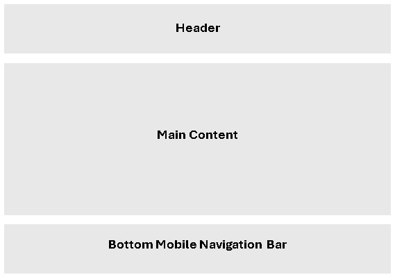
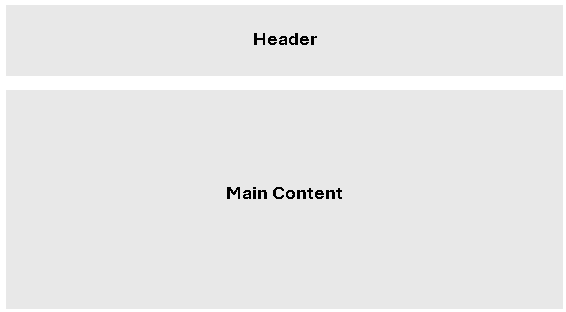

# Template Padrão da Aplicação

O Layout padrão da aplicação que será utilizado em todas as páginas com a definição de identidade visual, aspectos de responsividade e iconografia.

|  | 
| ------------- |
| Layout padrão para as telas Map, Relato e Perfil               |
|   | 
|Layout padrão para as telas Login e Cadastro|
|  |
